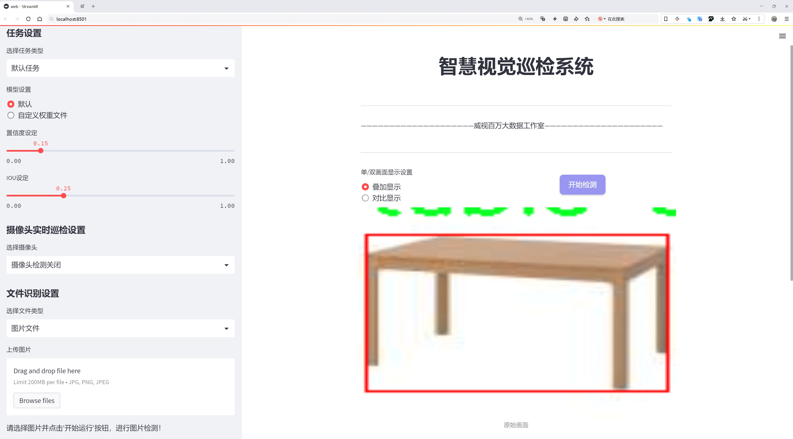
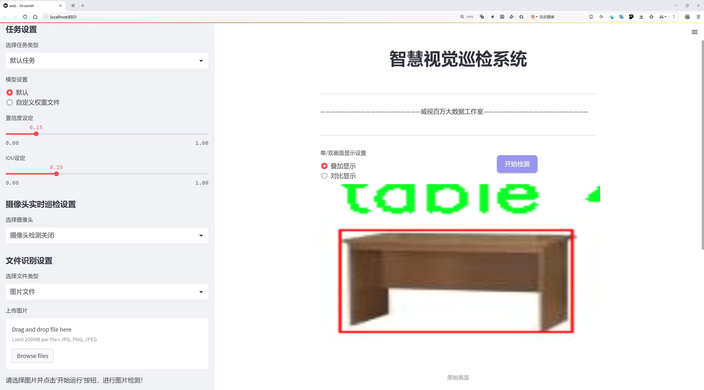
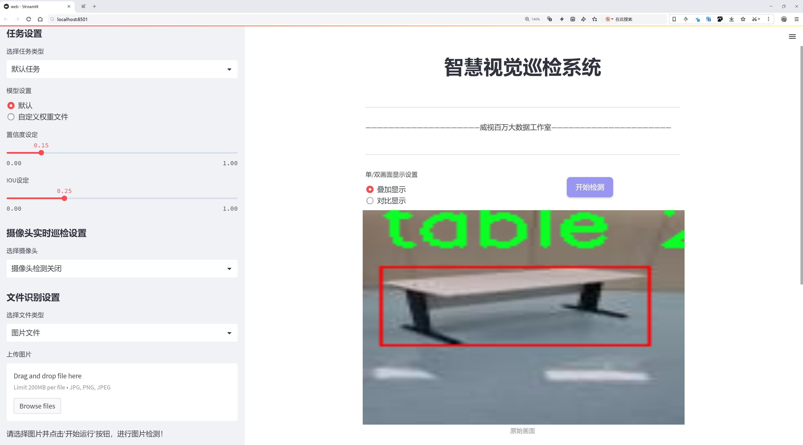

# 桌子检测检测系统源码分享
 # [一条龙教学YOLOV8标注好的数据集一键训练_70+全套改进创新点发刊_Web前端展示]

### 1.研究背景与意义

项目参考[AAAI Association for the Advancement of Artificial Intelligence](https://gitee.com/qunshansj/projects)

项目来源[AACV Association for the Advancement of Computer Vision](https://gitee.com/qunmasj/projects)

研究背景与意义

随着计算机视觉技术的快速发展，物体检测在各个领域的应用日益广泛。特别是在智能家居、自动化办公以及机器人导航等场景中，准确识别和定位桌子等家具物体显得尤为重要。桌子作为人们日常生活和工作中不可或缺的家具，其检测的准确性直接影响到后续任务的执行效果。近年来，YOLO（You Only Look Once）系列模型因其高效的实时检测能力而受到广泛关注。YOLOv8作为该系列的最新版本，进一步提升了检测精度和速度，为物体检测提供了新的可能性。然而，现有的YOLOv8模型在特定场景下的应用仍然存在一定的局限性，尤其是在复杂背景和多样化光照条件下的桌子检测任务中。

本研究旨在基于改进的YOLOv8模型，构建一个高效的桌子检测系统。为此，我们选用了一个包含196张图像的特定数据集，数据集中仅包含桌子这一类别。这一数据集的单一性虽然在类别上有所限制，但其图像数量足以为模型的训练和测试提供基本支持。通过对该数据集的深入分析，我们可以更好地理解桌子在不同环境中的外观特征和变化规律，从而为模型的改进提供数据支撑。

在研究过程中，我们将针对YOLOv8模型的结构进行优化，探索如何通过调整网络参数、增加数据增强技术以及引入迁移学习等方法，提升模型在桌子检测任务中的表现。通过这些改进，我们期望能够显著提高模型对桌子在不同场景下的检测准确率和鲁棒性，进而为实际应用提供可靠的技术支持。

本研究的意义不仅在于推动桌子检测技术的发展，更在于为物体检测领域提供新的思路和方法。随着智能家居和自动化办公的普及，桌子检测系统的应用前景广阔。通过实现高效、准确的桌子检测，我们可以为后续的智能家居控制、机器人路径规划等应用奠定基础。此外，研究成果还可以为其他家具物体的检测提供借鉴，推动整个物体检测技术的进步。

综上所述，基于改进YOLOv8的桌子检测系统的研究，不仅具有重要的理论价值，还有着广泛的实际应用前景。通过对现有技术的改进和创新，我们期望能够为智能家居和自动化领域的发展贡献一份力量，同时为后续的研究提供参考和启示。

### 2.图片演示







##### 注意：由于此博客编辑较早，上面“2.图片演示”和“3.视频演示”展示的系统图片或者视频可能为老版本，新版本在老版本的基础上升级如下：（实际效果以升级的新版本为准）

  （1）适配了YOLOV8的“目标检测”模型和“实例分割”模型，通过加载相应的权重（.pt）文件即可自适应加载模型。

  （2）支持“图片识别”、“视频识别”、“摄像头实时识别”三种识别模式。

  （3）支持“图片识别”、“视频识别”、“摄像头实时识别”三种识别结果保存导出，解决手动导出（容易卡顿出现爆内存）存在的问题，识别完自动保存结果并导出到tempDir中。

  （4）支持Web前端系统中的标题、背景图等自定义修改，后面提供修改教程。

  另外本项目提供训练的数据集和训练教程,暂不提供权重文件（best.pt）,需要您按照教程进行训练后实现图片演示和Web前端界面演示的效果。

### 3.视频演示

[3.1 视频演示](https://www.bilibili.com/video/BV1Wi4oefE8L/)

### 4.数据集信息展示

##### 4.1 本项目数据集详细数据（类别数＆类别名）

nc: 1
names: ['table']


##### 4.2 本项目数据集信息介绍

数据集信息展示

在本研究中，我们使用了名为“fedi”的数据集，以改进YOLOv8模型在桌子检测任务中的性能。该数据集专注于单一类别的物体识别，具体而言，它包含了大量的桌子图像，这些图像经过精心挑选和标注，以确保模型能够学习到桌子的各种特征和变化。数据集的类别数量为1，类别列表中仅包含“table”这一项，突显了我们研究的专一性和针对性。

“fedi”数据集的构建旨在为深度学习模型提供高质量的训练样本，以便在复杂的环境中准确识别桌子。数据集中的图像来源广泛，涵盖了不同类型的桌子，包括餐桌、办公桌、咖啡桌等，确保模型能够适应多样化的桌子外观和结构。这些图像不仅包括不同材质（如木质、金属、玻璃等）的桌子，还包含了不同的光照条件和背景环境，使得模型在训练过程中能够学习到更为丰富的特征。

为了提高模型的泛化能力，数据集中的图像经过了多种数据增强处理，包括旋转、缩放、裁剪和颜色调整等。这些增强手段不仅增加了数据集的多样性，还有效地减少了模型对特定图像特征的过拟合风险。此外，数据集还包含了不同角度和距离拍摄的桌子图像，确保模型能够在各种视角下进行准确的检测。

在标注方面，所有图像均由专业人员进行精确标注，确保每个桌子在图像中的位置和边界框都得到准确的描述。这种高质量的标注为YOLOv8模型的训练提供了坚实的基础，使得模型能够有效地学习到桌子的特征并进行准确的定位与分类。

在实验过程中，我们将“fedi”数据集划分为训练集和验证集，以便于评估模型的性能。训练集用于模型的训练，而验证集则用于监测模型在未见数据上的表现，从而调整模型参数，优化检测效果。通过这种方式，我们能够确保模型不仅在训练数据上表现良好，同时也具备良好的泛化能力。

总之，“fedi”数据集为改进YOLOv8的桌子检测系统提供了丰富而高质量的训练数据。其专注于单一类别的设计，使得模型能够深入学习桌子的特征，进而提高检测的准确性和鲁棒性。通过对数据集的精心构建和标注，我们期望能够在桌子检测领域取得显著的进展，为相关应用提供更为可靠的技术支持。


### 5.全套项目环境部署视频教程（零基础手把手教学）

[5.1 环境部署教程链接（零基础手把手教学）](https://www.ixigua.com/7404473917358506534?logTag=c807d0cbc21c0ef59de5)


[5.2 安装Python虚拟环境创建和依赖库安装视频教程链接（零基础手把手教学）](https://www.ixigua.com/7404474678003106304?logTag=1f1041108cd1f708b01a)

### 6.手把手YOLOV8训练视频教程（零基础小白有手就能学会）

[6.1 手把手YOLOV8训练视频教程（零基础小白有手就能学会）](https://www.ixigua.com/7404477157818401292?logTag=d31a2dfd1983c9668658)

### 7.70+种全套YOLOV8创新点代码加载调参视频教程（一键加载写好的改进模型的配置文件）

[7.1 70+种全套YOLOV8创新点代码加载调参视频教程（一键加载写好的改进模型的配置文件）](https://www.ixigua.com/7404478314661806627?logTag=29066f8288e3f4eea3a4)

### 8.70+种全套YOLOV8创新点原理讲解（非科班也可以轻松写刊发刊，V10版本正在科研待更新）

由于篇幅限制，每个创新点的具体原理讲解就不一一展开，具体见下列网址中的创新点对应子项目的技术原理博客网址【Blog】：


[8.1 70+种全套YOLOV8创新点原理讲解链接](https://gitee.com/qunmasj/good)

### 9.系统功能展示（检测对象为举例，实际内容以本项目数据集为准）

图9.1.系统支持检测结果表格显示

  图9.2.系统支持置信度和IOU阈值手动调节

  图9.3.系统支持自定义加载权重文件best.pt(需要你通过步骤5中训练获得)

  图9.4.系统支持摄像头实时识别

  图9.5.系统支持图片识别

  图9.6.系统支持视频识别

  图9.7.系统支持识别结果文件自动保存

  图9.8.系统支持Excel导出检测结果数据


### 10.原始YOLOV8算法原理

原始YOLOV8算法原理

YOLOv8作为YOLO系列中的一员，继承并发展了前几代模型的优点，尤其是在目标检测的精度和速度上取得了显著的提升。与以往的锚框（anchor-based）检测方法相比，YOLOv8采用了无锚框（anchor-free）策略，这一转变使得模型在复杂场景下的表现更加出色，尤其是在小目标检测方面。YOLOv8的网络结构主要由输入端、主干网络、Neck端和输出端四个模块组成，各个模块的设计都旨在提升特征提取的效率和目标检测的准确性。

在输入端，YOLOv8首先对输入图像进行了一系列预处理，包括Mosaic数据增强、自适应图片缩放和灰度填充等。这些步骤不仅增强了模型的鲁棒性，还提高了对不同场景和光照条件下目标的检测能力。通过这种方式，YOLOv8能够在多样化的环境中更好地适应并进行目标检测。

主干网络是YOLOv8的核心部分，采用了CSPDarknet（Cross Stage Partial Darknet）结构，显著提升了特征提取的能力。CSPDarknet通过将输入特征图分为两个分支，利用多个残差块进行特征提取，增强了模型对特征的表达能力。YOLOv8引入了C2f模块，替代了之前的C3模块，C2f模块的设计使得特征图的维度更高，并通过堆叠多个分支，确保了更丰富的梯度流信息。这种设计不仅提高了特征提取的效率，还使得模型在处理复杂场景时能够更好地捕捉细节。

在Neck端，YOLOv8采用了基于路径聚合网络（PAN）的结构，通过上采样和下采样操作对不同尺度的特征图进行融合。这一过程有效地增强了特征图的上下文信息，使得模型在进行目标检测时能够综合考虑不同尺度的特征，从而提高检测的准确性。此外，YOLOv8还引入了快速空间金字塔池化（SPPF）结构，进一步提升了对多尺度特征的提取能力，减少了模型的参数量和计算量。

输出端采用了解耦头（Decoupled Head）结构，将分类和回归过程分开进行。这一设计的优点在于可以独立优化分类和回归任务，从而提高模型的整体性能。YOLOv8使用了Task-Aligned Assigner方法，对分类分数和回归分数进行加权匹配，确保正样本的选择更加精准。损失计算方面，YOLOv8采用了二元交叉熵（BCE）损失函数来计算分类损失，同时使用分布焦点损失（DFL）和完全交并比（CIoU）损失函数来计算回归损失。这种损失函数的选择使得模型在训练过程中能够更好地适应目标的多样性，提高了检测的精度。

尽管YOLOv8在许多方面表现出色，但在复杂水面环境下的应用仍然面临挑战。小目标漂浮物的特征复杂，背景多样，导致YOLOv8在定位和目标感知能力上存在不足。为了解决这些问题，研究者们提出了YOLOv8-WSSOD算法的改进方案。该方案首先引入了BiFormer双层路由注意力机制，构建了C2fBF模块，以减轻主干网络下采样过程中的噪声影响。这一改进旨在保留特征提取过程中更细粒度的上下文信息，从而提升模型对小目标的感知能力。

此外，YOLOv8-WSSOD还在Neck端引入了GSConv和Slim-neck技术，这些技术的应用不仅保持了模型的精度，还有效降低了计算量。为了进一步提升模型的泛化能力和精准度，YOLOv8-WSSOD采用了MPDIoU损失函数替代了CIoU损失函数。这一损失函数的改进使得模型在处理复杂背景和小目标时，能够更好地进行定位和分类。

综上所述，YOLOv8通过其创新的网络结构和高效的特征提取机制，显著提升了目标检测的精度和速度。尽管在某些复杂环境下仍存在不足，但通过针对性的改进方案，YOLOv8的应用潜力得到了进一步拓展。未来，随着算法的不断优化和数据集的丰富，YOLOv8及其衍生版本有望在更广泛的领域中发挥重要作用。


### 11.项目核心源码讲解（再也不用担心看不懂代码逻辑）

#### 11.1 ui.py

以下是经过简化和注释的核心代码部分：

```python
import sys
import subprocess
from QtFusion.path import abs_path

def run_script(script_path):
    """
    使用当前 Python 环境运行指定的脚本。

    Args:
        script_path (str): 要运行的脚本路径
    """
    # 获取当前 Python 解释器的路径
    python_path = sys.executable

    # 构建运行命令，使用 streamlit 运行指定的脚本
    command = f'"{python_path}" -m streamlit run "{script_path}"'

    # 执行命令并等待其完成
    result = subprocess.run(command, shell=True)
    
    # 检查命令执行结果，如果返回码不为0，则表示出错
    if result.returncode != 0:
        print("脚本运行出错。")

# 主程序入口
if __name__ == "__main__":
    # 获取脚本的绝对路径
    script_path = abs_path("web.py")

    # 运行指定的脚本
    run_script(script_path)
```

### 代码分析与注释：

1. **导入模块**：
   - `sys`：用于访问与 Python 解释器相关的变量和函数。
   - `subprocess`：用于执行外部命令。
   - `abs_path`：从 `QtFusion.path` 导入的函数，用于获取文件的绝对路径。

2. **`run_script` 函数**：
   - 功能：接受一个脚本路径，并使用当前 Python 环境运行该脚本。
   - 参数：`script_path` 是要运行的脚本的路径。
   - 获取当前 Python 解释器的路径，以便在命令中使用。
   - 构建命令字符串，使用 `streamlit` 运行指定的脚本。
   - 使用 `subprocess.run` 执行命令，并等待其完成。
   - 检查命令的返回码，如果不为0，表示脚本运行出错，打印错误信息。

3. **主程序入口**：
   - 通过 `if __name__ == "__main__":` 确保只有在直接运行该脚本时才会执行以下代码。
   - 获取脚本 `web.py` 的绝对路径。
   - 调用 `run_script` 函数运行该脚本。 

这段代码的核心功能是通过 `streamlit` 运行一个指定的 Python 脚本，并处理可能出现的错误。

这个文件是一个 Python 脚本，主要用于运行另一个 Python 脚本（在这里是 `web.py`），并且使用的是 Streamlit 库来启动一个 Web 应用。首先，文件导入了必要的模块，包括 `sys`、`os` 和 `subprocess`，这些模块提供了与系统交互的功能。

在 `run_script` 函数中，首先获取当前 Python 解释器的路径，这样可以确保使用正确的 Python 环境来运行脚本。接着，构建了一个命令字符串，这个命令将调用 Streamlit 来运行指定的脚本。命令的格式是 `python -m streamlit run "script_path"`，其中 `script_path` 是传入的参数。

然后，使用 `subprocess.run` 方法执行这个命令。这个方法会在一个新的 shell 中运行命令，并等待其完成。如果命令执行的返回码不为零，表示脚本运行出错，此时会打印出错误信息。

在文件的最后部分，使用 `if __name__ == "__main__":` 语句来确保只有在直接运行这个脚本时才会执行下面的代码。这里指定了要运行的脚本路径为 `web.py`，并调用 `run_script` 函数来启动这个脚本。

整体来看，这个文件的功能是提供一个简单的接口，通过命令行启动一个 Streamlit Web 应用，便于开发和测试。

#### 11.2 code\ultralytics\hub\__init__.py

以下是代码中最核心的部分，并附上详细的中文注释：

```python
import requests  # 导入requests库，用于发送HTTP请求

from ultralytics.hub.auth import Auth  # 导入身份验证模块
from ultralytics.utils import LOGGER, SETTINGS  # 导入日志记录和设置模块

def login(api_key: str = None, save=True) -> bool:
    """
    使用提供的API密钥登录Ultralytics HUB API。

    Args:
        api_key (str, optional): 用于身份验证的API密钥。如果未提供，将从SETTINGS或HUB_API_KEY环境变量中检索。
        save (bool, optional): 如果身份验证成功，是否将API密钥保存到SETTINGS中。
    Returns:
        bool: 如果身份验证成功，则返回True，否则返回False。
    """
    # 检查所需的库是否已安装
    from hub_sdk import HUBClient  # 导入HUB客户端

    # 设置API密钥的URL
    api_key_url = f"{HUB_WEB_ROOT}/settings?tab=api+keys"
    saved_key = SETTINGS.get("api_key")  # 从设置中获取已保存的API密钥
    active_key = api_key or saved_key  # 如果提供了api_key，则使用它，否则使用已保存的密钥
    credentials = {"api_key": active_key} if active_key and active_key != "" else None  # 设置凭据

    client = HUBClient(credentials)  # 初始化HUB客户端

    if client.authenticated:  # 如果成功认证
        if save and client.api_key != saved_key:
            SETTINGS.update({"api_key": client.api_key})  # 更新设置中的API密钥

        # 根据提供的密钥或从设置中检索的密钥设置日志消息
        log_message = (
            "New authentication successful ✅" if client.api_key == api_key or not credentials else "Authenticated ✅"
        )
        LOGGER.info(f"{PREFIX}{log_message}")  # 记录成功登录的信息

        return True  # 返回成功状态
    else:
        # 如果认证失败
        LOGGER.info(f"{PREFIX}Retrieve API key from {api_key_url}")  # 记录获取API密钥的提示
        return False  # 返回失败状态


def logout():
    """
    从Ultralytics HUB注销，通过从设置文件中删除API密钥。要重新登录，请使用'yolo hub login'。
    """
    SETTINGS["api_key"] = ""  # 清空API密钥
    SETTINGS.save()  # 保存设置
    LOGGER.info(f"{PREFIX}logged out ✅. To log in again, use 'yolo hub login'.")  # 记录注销信息


def reset_model(model_id=""):
    """将训练过的模型重置为未训练状态。"""
    # 发送POST请求以重置模型
    r = requests.post(f"{HUB_API_ROOT}/model-reset", json={"modelId": model_id}, headers={"x-api-key": Auth().api_key})
    if r.status_code == 200:  # 如果请求成功
        LOGGER.info(f"{PREFIX}Model reset successfully")  # 记录重置成功的信息
        return
    LOGGER.warning(f"{PREFIX}Model reset failure {r.status_code} {r.reason}")  # 记录重置失败的信息


def export_model(model_id="", format="torchscript"):
    """将模型导出为所有格式。"""
    # 确保导出格式是支持的格式
    assert format in export_fmts_hub(), f"Unsupported export format '{format}', valid formats are {export_fmts_hub()}"
    # 发送POST请求以导出模型
    r = requests.post(
        f"{HUB_API_ROOT}/v1/models/{model_id}/export", json={"format": format}, headers={"x-api-key": Auth().api_key}
    )
    assert r.status_code == 200, f"{PREFIX}{format} export failure {r.status_code} {r.reason}"  # 检查导出是否成功
    LOGGER.info(f"{PREFIX}{format} export started ✅")  # 记录导出开始的信息


def check_dataset(path="", task="detect"):
    """
    在上传之前检查HUB数据集Zip文件的错误。它在上传到HUB之前检查数据集是否存在错误。

    Args:
        path (str, optional): 数据集Zip文件的路径（其中包含data.yaml）。默认为''。
        task (str, optional): 数据集任务。选项有'detect'、'segment'、'pose'、'classify'。默认为'detect'。
    """
    # 使用HUBDatasetStats检查数据集
    HUBDatasetStats(path=path, task=task).get_json()
    LOGGER.info(f"Checks completed correctly ✅. Upload this dataset to {HUB_WEB_ROOT}/datasets/.")  # 记录检查完成的信息
```

### 代码核心部分说明：
1. **登录功能**：`login`函数用于通过API密钥进行身份验证，并可以选择保存密钥。
2. **注销功能**：`logout`函数用于注销用户，清空API密钥。
3. **模型重置**：`reset_model`函数用于将已训练的模型重置为未训练状态。
4. **模型导出**：`export_model`函数用于将模型导出为指定格式。
5. **数据集检查**：`check_dataset`函数用于在上传之前检查数据集的有效性。

这个程序文件是Ultralytics YOLO（You Only Look Once）库的一部分，主要用于与Ultralytics HUB进行交互。文件中包含了一些用于身份验证、模型管理和数据集检查的函数。

首先，文件导入了一些必要的模块和工具，包括用于处理数据集统计的`HUBDatasetStats`、身份验证的`Auth`、以及一些常量和日志记录工具。接着，定义了多个函数。

`login`函数用于通过提供的API密钥登录Ultralytics HUB API。如果没有提供API密钥，它会尝试从设置或环境变量中获取。成功认证后，可以选择将API密钥保存到设置中。函数返回一个布尔值，指示认证是否成功。

`logout`函数用于注销Ultralytics HUB，具体实现是将API密钥从设置中移除。用户可以通过调用`yolo hub login`再次登录。

`reset_model`函数用于将训练过的模型重置为未训练状态。它通过发送POST请求到HUB API来实现，成功后会记录相关信息。

`export_fmts_hub`函数返回HUB支持的所有导出格式的列表，方便用户了解可以使用的格式。

`export_model`函数用于将模型导出为指定格式。它首先检查格式是否受支持，然后发送请求以开始导出过程。

`get_export`函数用于获取已导出的模型的字典，包括下载链接。它同样会检查格式的有效性，并在请求成功后返回相应的JSON数据。

最后，`check_dataset`函数用于在上传之前检查HUB数据集的ZIP文件是否存在错误。它会验证数据集的结构，并提供相应的反馈，确保用户可以顺利上传数据集。

整体而言，这个文件提供了一系列功能，帮助用户管理与Ultralytics HUB的交互，包括登录、注销、模型导出和数据集检查等操作。

#### 11.3 code\ultralytics\hub\utils.py

以下是代码中最核心的部分，并附上详细的中文注释：

```python
import requests
import threading
import time
from ultralytics.utils import LOGGER, SETTINGS, ENVIRONMENT, __version__

def requests_with_progress(method, url, **kwargs):
    """
    使用指定的方法和URL进行HTTP请求，并可选地显示进度条。

    参数:
        method (str): 要使用的HTTP方法（例如 'GET', 'POST'）。
        url (str): 要发送请求的URL。
        **kwargs (dict): 传递给底层 `requests.request` 函数的其他关键字参数。

    返回:
        (requests.Response): HTTP请求的响应对象。
    """
    progress = kwargs.pop("progress", False)  # 从kwargs中获取进度参数
    if not progress:
        return requests.request(method, url, **kwargs)  # 如果没有进度条，直接返回请求结果
    
    # 否则，开启流式请求
    response = requests.request(method, url, stream=True, **kwargs)
    total = int(response.headers.get("content-length", 0))  # 获取响应内容的总大小
    try:
        pbar = TQDM(total=total, unit="B", unit_scale=True, unit_divisor=1024)  # 初始化进度条
        for data in response.iter_content(chunk_size=1024):  # 按块读取内容
            pbar.update(len(data))  # 更新进度条
        pbar.close()  # 关闭进度条
    except requests.exceptions.ChunkedEncodingError:  # 处理连接中断的异常
        response.close()  # 关闭响应
    return response  # 返回响应对象

def smart_request(method, url, retry=3, timeout=30, thread=True, verbose=True, progress=False, **kwargs):
    """
    使用'requests'库进行HTTP请求，支持指数退避重试机制。

    参数:
        method (str): 请求使用的HTTP方法。
        url (str): 要请求的URL。
        retry (int, optional): 尝试重试的次数，默认为3。
        timeout (int, optional): 超时时间（秒），默认为30。
        thread (bool, optional): 是否在单独的线程中执行请求，默认为True。
        verbose (bool, optional): 是否在控制台打印信息，默认为True。
        progress (bool, optional): 是否在请求过程中显示进度条，默认为False。
        **kwargs (dict): 传递给请求函数的其他关键字参数。

    返回:
        (requests.Response): HTTP响应对象。
    """
    retry_codes = (408, 500)  # 需要重试的HTTP状态码

    @TryExcept(verbose=verbose)
    def func(func_method, func_url, **func_kwargs):
        """执行HTTP请求，支持重试和超时，带有可选的进度跟踪。"""
        r = None  # 响应对象
        t0 = time.time()  # 记录开始时间
        for i in range(retry + 1):
            if (time.time() - t0) > timeout:  # 超过超时时间则退出
                break
            r = requests_with_progress(func_method, func_url, **func_kwargs)  # 发起请求
            if r.status_code < 300:  # 如果响应状态码在2xx范围内，表示成功
                break
            # 处理错误信息
            if i == 0 and r.status_code in retry_codes:
                LOGGER.warning(f"请求失败，正在重试 {retry} 次。状态码: {r.status_code}")
            time.sleep(2**i)  # 指数退避
        return r  # 返回响应对象

    args = method, url
    kwargs["progress"] = progress  # 将进度参数传递给请求函数
    if thread:
        threading.Thread(target=func, args=args, kwargs=kwargs, daemon=True).start()  # 在新线程中执行请求
    else:
        return func(*args, **kwargs)  # 直接执行请求

class Events:
    """
    用于收集匿名事件分析的类。事件分析在设置中启用sync=True时启用，sync=False时禁用。

    属性:
        url (str): 发送匿名事件的URL。
        rate_limit (float): 发送事件的速率限制（秒）。
        metadata (dict): 包含环境元数据的字典。
        enabled (bool): 根据某些条件启用或禁用事件的标志。
    """

    url = "https://www.google-analytics.com/mp/collect?measurement_id=G-X8NCJYTQXM&api_secret=QLQrATrNSwGRFRLE-cbHJw"

    def __init__(self):
        """初始化Events对象，设置事件、速率限制和元数据的默认值。"""
        self.events = []  # 事件列表
        self.rate_limit = 60.0  # 速率限制（秒）
        self.t = 0.0  # 速率限制计时器（秒）
        self.metadata = {
            "version": __version__,  # 版本信息
            "env": ENVIRONMENT,  # 环境信息
        }
        self.enabled = SETTINGS["sync"]  # 根据设置决定是否启用事件

    def __call__(self, cfg):
        """
        尝试将新事件添加到事件列表，并在达到速率限制时发送事件。

        参数:
            cfg (IterableSimpleNamespace): 包含模式和任务信息的配置对象。
        """
        if not self.enabled:
            return  # 如果事件被禁用，则不执行任何操作

        # 尝试添加事件
        if len(self.events) < 25:  # 事件列表限制为25个事件
            params = {
                "task": cfg.task,
                "model": cfg.model,
            }
            self.events.append({"name": cfg.mode, "params": params})  # 添加事件

        # 检查速率限制
        t = time.time()
        if (t - self.t) < self.rate_limit:
            return  # 如果在速率限制内，则不发送事件

        # 超过速率限制，发送事件
        data = {"client_id": SETTINGS["uuid"], "events": self.events}  # 包含事件的请求数据
        smart_request("post", self.url, json=data, retry=0, verbose=False)  # 发送POST请求

        # 重置事件和速率限制计时器
        self.events = []
        self.t = t

# 初始化事件收集器
events = Events()
```

### 代码说明
1. **requests_with_progress**: 该函数用于发送HTTP请求，并在下载过程中显示进度条。它支持流式下载，适用于大文件的下载。
2. **smart_request**: 该函数实现了带有重试机制的HTTP请求。它会在请求失败时根据状态码进行重试，并支持在新线程中执行请求。
3. **Events类**: 该类用于收集和发送匿名事件分析数据。它会根据设置决定是否启用事件收集，并在达到速率限制时发送事件数据。

这个程序文件主要是为Ultralytics YOLO（一个目标检测模型）提供一些实用工具和功能，尤其是在处理HTTP请求和事件分析方面。文件的结构和功能可以分为几个主要部分。

首先，文件导入了一些必要的库和模块，包括操作系统、平台、随机数、线程、时间等标准库，以及Ultralytics自定义的工具模块。这些导入的工具提供了日志记录、环境检测、版本信息、颜色字符串处理等功能。

接下来，文件定义了一些常量，例如HUB_API_ROOT和HUB_WEB_ROOT，这些常量用于指定Ultralytics Hub的API和Web地址。还定义了一个前缀和帮助信息，用于在发生错误时提供给用户。

文件中有几个重要的函数。`request_with_credentials`函数用于在Google Colab环境中进行带有凭证的AJAX请求。它通过JavaScript代码实现了在Colab中发送POST请求，并处理响应数据。如果该函数在非Colab环境中调用，则会抛出异常。

`requests_with_progress`函数用于执行HTTP请求，并可选择性地显示下载进度条。它支持多种HTTP方法（如GET和POST），并通过`TQDM`库显示下载进度，便于用户了解请求的进度。

`smart_request`函数则是一个更为复杂的HTTP请求处理函数，支持重试机制和超时设置。它使用指数退避算法进行重试，适用于处理临时的网络问题或服务器错误。该函数还可以在后台线程中运行，以避免阻塞主线程。

此外，文件中定义了一个`Events`类，用于收集匿名事件分析数据。该类会在特定条件下启用，并收集有关环境的元数据。事件的发送受到速率限制，以避免过于频繁的请求。类的构造函数初始化了一些属性，并根据设置决定是否启用事件收集。`__call__`方法则用于添加新事件并在达到速率限制时发送事件数据。

最后，文件在底部创建了一个`Events`类的实例，以便在整个模块中使用事件分析功能。

总的来说，这个文件提供了一系列工具，旨在简化Ultralytics YOLO模型在网络请求和事件跟踪方面的操作，增强用户体验和数据收集能力。

#### 11.4 70+种YOLOv8算法改进源码大全和调试加载训练教程（非必要）\ultralytics\models\yolo\classify\predict.py

以下是代码中最核心的部分，并附上详细的中文注释：

```python
import torch  # 导入PyTorch库

from ultralytics.engine.predictor import BasePredictor  # 从Ultralytics引擎导入基类预测器
from ultralytics.engine.results import Results  # 从Ultralytics引擎导入结果类
from ultralytics.utils import DEFAULT_CFG, ops  # 导入默认配置和操作工具

class ClassificationPredictor(BasePredictor):
    """
    扩展BasePredictor类的分类预测器。

    注意：
        - 可以将Torchvision分类模型传递给'model'参数，例如：model='resnet18'。
    """

    def __init__(self, cfg=DEFAULT_CFG, overrides=None, _callbacks=None):
        """初始化ClassificationPredictor，将任务设置为'分类'。"""
        super().__init__(cfg, overrides, _callbacks)  # 调用父类构造函数
        self.args.task = 'classify'  # 设置任务类型为分类

    def preprocess(self, img):
        """将输入图像转换为模型兼容的数据类型。"""
        # 如果输入不是张量，则将其转换为张量
        if not isinstance(img, torch.Tensor):
            img = torch.stack([self.transforms(im) for im in img], dim=0)  # 对每个图像应用转换并堆叠
        # 将图像移动到模型所在的设备（CPU或GPU）
        img = (img if isinstance(img, torch.Tensor) else torch.from_numpy(img)).to(self.model.device)
        # 根据模型的精度设置将图像转换为半精度或单精度浮点数
        return img.half() if self.model.fp16 else img.float()  # uint8转换为fp16/32

    def postprocess(self, preds, img, orig_imgs):
        """对预测结果进行后处理，返回Results对象。"""
        # 如果原始图像不是列表，则将其转换为numpy数组
        if not isinstance(orig_imgs, list):  # 输入图像是torch.Tensor，而不是列表
            orig_imgs = ops.convert_torch2numpy_batch(orig_imgs)  # 转换为numpy格式

        results = []  # 初始化结果列表
        # 遍历每个预测结果
        for i, pred in enumerate(preds):
            orig_img = orig_imgs[i]  # 获取原始图像
            img_path = self.batch[0][i]  # 获取图像路径
            # 将结果添加到结果列表中
            results.append(Results(orig_img, path=img_path, names=self.model.names, probs=pred))
        return results  # 返回结果列表
```

### 代码核心部分说明：
1. **导入必要的库和模块**：导入PyTorch和Ultralytics库中的相关模块。
2. **ClassificationPredictor类**：该类继承自`BasePredictor`，用于实现分类模型的预测功能。
3. **初始化方法**：设置任务类型为分类，并调用父类的初始化方法。
4. **预处理方法**：将输入图像转换为模型所需的格式，包括将图像转换为张量并移动到适当的设备上。
5. **后处理方法**：将模型的预测结果转换为`Results`对象，以便于后续处理和分析。

该程序文件是一个用于YOLOv8分类模型预测的实现，主要定义了一个名为`ClassificationPredictor`的类，继承自`BasePredictor`类。该类的主要功能是处理图像分类任务，并提供相应的预测功能。

在文件开头，首先导入了必要的库，包括`torch`和一些来自`ultralytics`库的模块。接着，定义了`ClassificationPredictor`类，该类专门用于基于分类模型进行预测。类的文档字符串中提到，可以将Torchvision的分类模型传递给`model`参数，例如`model='resnet18'`，并给出了一个使用示例，展示了如何创建`ClassificationPredictor`实例并调用其预测功能。

在类的构造函数`__init__`中，调用了父类的构造函数，并将任务类型设置为`classify`，表明该预测器的任务是进行分类。

`preprocess`方法用于对输入图像进行预处理，以转换为模型兼容的数据类型。它首先检查输入是否为`torch.Tensor`类型，如果不是，则将其转换为张量。接着，图像被移动到模型所在的设备上，并根据模型的精度设置（fp16或fp32）进行类型转换。

`postprocess`方法则用于对模型的预测结果进行后处理，返回`Results`对象。该方法首先检查原始图像是否为列表，如果不是，则将其转换为NumPy数组。然后，它遍历每个预测结果，将原始图像、图像路径和预测概率封装到`Results`对象中，并将这些对象存储在结果列表中，最终返回该列表。

整体来看，该文件提供了一个清晰的框架，用于处理图像分类任务的预测过程，包括输入的预处理和输出的后处理，适用于使用YOLOv8模型进行分类的场景。

#### 11.5 train.py

以下是经过简化并注释的核心代码部分，主要保留了与YOLO目标检测训练相关的功能：

```python
import random
import numpy as np
import torch.nn as nn
from ultralytics.data import build_dataloader, build_yolo_dataset
from ultralytics.engine.trainer import BaseTrainer
from ultralytics.models import yolo
from ultralytics.nn.tasks import DetectionModel
from ultralytics.utils import LOGGER, RANK
from ultralytics.utils.torch_utils import de_parallel, torch_distributed_zero_first

class DetectionTrainer(BaseTrainer):
    """
    扩展自BaseTrainer类，用于基于检测模型的训练。
    """

    def build_dataset(self, img_path, mode="train", batch=None):
        """
        构建YOLO数据集。

        参数:
            img_path (str): 包含图像的文件夹路径。
            mode (str): 模式为'train'或'val'，用户可以为每种模式自定义不同的增强。
            batch (int, optional): 批次大小，适用于'rect'模式。默认为None。
        """
        gs = max(int(de_parallel(self.model).stride.max() if self.model else 0), 32)
        return build_yolo_dataset(self.args, img_path, batch, self.data, mode=mode, rect=mode == "val", stride=gs)

    def get_dataloader(self, dataset_path, batch_size=16, rank=0, mode="train"):
        """构造并返回数据加载器。"""
        assert mode in ["train", "val"]
        with torch_distributed_zero_first(rank):  # 在分布式训练中仅初始化一次数据集
            dataset = self.build_dataset(dataset_path, mode, batch_size)
        shuffle = mode == "train"  # 训练模式下打乱数据
        workers = self.args.workers if mode == "train" else self.args.workers * 2
        return build_dataloader(dataset, batch_size, workers, shuffle, rank)  # 返回数据加载器

    def preprocess_batch(self, batch):
        """对图像批次进行预处理，包括缩放和转换为浮点数。"""
        batch["img"] = batch["img"].to(self.device, non_blocking=True).float() / 255  # 将图像转换为浮点数并归一化
        if self.args.multi_scale:  # 如果启用多尺度训练
            imgs = batch["img"]
            sz = (
                random.randrange(self.args.imgsz * 0.5, self.args.imgsz * 1.5 + self.stride)
                // self.stride
                * self.stride
            )  # 随机选择图像大小
            sf = sz / max(imgs.shape[2:])  # 计算缩放因子
            if sf != 1:
                ns = [
                    math.ceil(x * sf / self.stride) * self.stride for x in imgs.shape[2:]
                ]  # 计算新的图像形状
                imgs = nn.functional.interpolate(imgs, size=ns, mode="bilinear", align_corners=False)  # 进行插值
            batch["img"] = imgs
        return batch

    def get_model(self, cfg=None, weights=None, verbose=True):
        """返回YOLO检测模型。"""
        model = DetectionModel(cfg, nc=self.data["nc"], verbose=verbose and RANK == -1)  # 创建检测模型
        if weights:
            model.load(weights)  # 加载权重
        return model

    def plot_training_samples(self, batch, ni):
        """绘制带有注释的训练样本。"""
        plot_images(
            images=batch["img"],
            batch_idx=batch["batch_idx"],
            cls=batch["cls"].squeeze(-1),
            bboxes=batch["bboxes"],
            paths=batch["im_file"],
            fname=self.save_dir / f"train_batch{ni}.jpg",
            on_plot=self.on_plot,
        )

    def plot_metrics(self):
        """从CSV文件中绘制指标。"""
        plot_results(file=self.csv, on_plot=self.on_plot)  # 保存结果图
```

### 代码注释说明：
1. **build_dataset**: 该方法用于构建YOLO数据集，支持训练和验证模式，可以自定义数据增强。
2. **get_dataloader**: 构造数据加载器，支持分布式训练，处理数据集的加载和打乱。
3. **preprocess_batch**: 对输入的图像批次进行预处理，包括归一化和可能的缩放操作。
4. **get_model**: 创建并返回YOLO检测模型，可以选择加载预训练权重。
5. **plot_training_samples**: 绘制训练样本及其对应的注释，便于可视化训练过程。
6. **plot_metrics**: 从CSV文件中读取训练指标并绘制图表，便于监控训练效果。

这个程序文件 `train.py` 是一个用于训练目标检测模型的脚本，主要基于 YOLO（You Only Look Once）架构。它继承自 `BaseTrainer` 类，专注于处理目标检测任务。程序中导入了多个模块和库，包括 NumPy、PyTorch 以及 Ultralytics 提供的工具和模型。

在 `DetectionTrainer` 类中，定义了一系列方法来构建数据集、获取数据加载器、预处理图像批次、设置模型属性、获取模型、获取验证器、记录损失、输出训练进度、绘制训练样本和指标等。

`build_dataset` 方法用于构建 YOLO 数据集，接收图像路径、模式（训练或验证）和批次大小作为参数。它会根据模型的步幅（stride）计算出合适的大小，并调用 `build_yolo_dataset` 函数来创建数据集。

`get_dataloader` 方法用于构建并返回数据加载器。它会根据模式决定是否打乱数据，并设置工作线程的数量。通过 `torch_distributed_zero_first` 函数确保在分布式训练时只初始化一次数据集。

`preprocess_batch` 方法负责对图像批次进行预处理，包括将图像缩放到合适的大小并转换为浮点数格式。它还支持多尺度训练，通过随机选择图像大小来增强模型的鲁棒性。

`set_model_attributes` 方法用于设置模型的属性，包括类别数量和类别名称，以便模型能够正确识别不同的目标。

`get_model` 方法返回一个 YOLO 检测模型实例，并可以加载预训练权重。

`get_validator` 方法返回一个用于验证模型性能的验证器实例，能够计算损失并保存结果。

`label_loss_items` 方法用于返回一个包含训练损失项的字典，便于监控训练过程中的损失变化。

`progress_string` 方法生成一个格式化的字符串，显示训练进度，包括当前的 epoch、GPU 内存使用情况、损失值、实例数量和图像大小。

`plot_training_samples` 方法用于绘制训练样本及其标注，帮助可视化训练数据的质量。

最后，`plot_metrics` 和 `plot_training_labels` 方法用于绘制训练过程中的指标和标签，帮助分析模型的训练效果。

整体来看，这个脚本为训练 YOLO 模型提供了全面的功能，包括数据处理、模型训练、验证和结果可视化，适合用于目标检测任务的研究和应用。

#### 11.6 70+种YOLOv8算法改进源码大全和调试加载训练教程（非必要）\ultralytics\nn\tasks.py

以下是代码中最核心的部分，并附上详细的中文注释：

```python
import torch
import torch.nn as nn

class BaseModel(nn.Module):
    """BaseModel类是Ultralytics YOLO系列模型的基类。"""

    def forward(self, x, *args, **kwargs):
        """
        模型的前向传播，处理单个尺度的输入。
        
        参数:
            x (torch.Tensor | dict): 输入图像张量或包含图像张量和真实标签的字典。
        
        返回:
            (torch.Tensor): 网络的输出。
        """
        if isinstance(x, dict):  # 如果输入是字典，表示训练或验证阶段
            return self.loss(x, *args, **kwargs)  # 计算损失
        return self.predict(x, *args, **kwargs)  # 进行预测

    def predict(self, x, profile=False, visualize=False, augment=False):
        """
        通过网络执行前向传播。
        
        参数:
            x (torch.Tensor): 输入张量。
            profile (bool): 如果为True，打印每层的计算时间，默认为False。
            visualize (bool): 如果为True，保存模型的特征图，默认为False。
            augment (bool): 在预测时进行图像增强，默认为False。
        
        返回:
            (torch.Tensor): 模型的最后输出。
        """
        if augment:
            return self._predict_augment(x)  # 进行增强预测
        return self._predict_once(x, profile, visualize)  # 单次预测

    def _predict_once(self, x, profile=False, visualize=False):
        """
        执行一次前向传播。
        
        参数:
            x (torch.Tensor): 输入张量。
            profile (bool): 如果为True，打印每层的计算时间，默认为False。
            visualize (bool): 如果为True，保存模型的特征图，默认为False。
        
        返回:
            (torch.Tensor): 模型的最后输出。
        """
        y, dt = [], []  # 输出列表和时间列表
        for m in self.model:  # 遍历模型中的每一层
            if m.f != -1:  # 如果不是来自前一层
                x = y[m.f] if isinstance(m.f, int) else [x if j == -1 else y[j] for j in m.f]  # 从早期层获取输入
            if profile:
                self._profile_one_layer(m, x, dt)  # 记录当前层的性能
            x = m(x)  # 执行当前层的前向传播
            y.append(x if m.i in self.save else None)  # 保存输出
            if visualize:
                feature_visualization(x, m.type, m.i, save_dir=visualize)  # 可视化特征图
        return x  # 返回最后的输出

    def loss(self, batch, preds=None):
        """
        计算损失。
        
        参数:
            batch (dict): 用于计算损失的批次数据。
            preds (torch.Tensor | List[torch.Tensor]): 预测结果。
        
        返回:
            (torch.Tensor): 计算得到的损失值。
        """
        if not hasattr(self, 'criterion'):
            self.criterion = self.init_criterion()  # 初始化损失函数

        preds = self.forward(batch['img']) if preds is None else preds  # 获取预测结果
        return self.criterion(preds, batch)  # 计算损失

    def init_criterion(self):
        """初始化BaseModel的损失标准。"""
        raise NotImplementedError('compute_loss() needs to be implemented by task heads')


class DetectionModel(BaseModel):
    """YOLOv8检测模型。"""

    def __init__(self, cfg='yolov8n.yaml', ch=3, nc=None, verbose=True):
        """使用给定的配置和参数初始化YOLOv8检测模型。"""
        super().__init__()
        self.yaml = cfg if isinstance(cfg, dict) else yaml_model_load(cfg)  # 加载配置字典

        # 定义模型
        ch = self.yaml['ch'] = self.yaml.get('ch', ch)  # 输入通道
        if nc and nc != self.yaml['nc']:
            self.yaml['nc'] = nc  # 覆盖YAML中的类别数
        self.model, self.save = parse_model(deepcopy(self.yaml), ch=ch, verbose=verbose)  # 解析模型
        self.names = {i: f'{i}' for i in range(self.yaml['nc'])}  # 默认名称字典

        # 初始化权重和偏置
        initialize_weights(self)

    def init_criterion(self):
        """初始化DetectionModel的损失标准。"""
        return v8DetectionLoss(self)  # 返回YOLOv8检测损失

# 其他模型类（SegmentationModel, PoseModel, ClassificationModel等）可根据需要添加
```

以上代码是YOLOv8模型的核心部分，包含了模型的基本结构、前向传播、损失计算等功能。注释详细解释了每个方法的作用和参数，便于理解代码的功能和实现。

这个程序文件是一个实现YOLOv8模型的基础代码，主要用于目标检测、分割、姿态估计和分类等任务。文件中定义了多个类和函数，构成了YOLOv8模型的核心结构。

首先，文件导入了一些必要的库，包括PyTorch、Ultralytics自定义模块以及其他一些工具函数。接着，定义了一个基类`BaseModel`，它是所有YOLOv8模型的基础。该类实现了模型的前向传播、预测、损失计算等基本功能。`forward`方法根据输入的类型（图像或字典）选择合适的处理方式，调用`predict`方法进行预测。

`predict`方法执行模型的前向传播，并可以选择是否进行特征可视化和计算时间分析。`_predict_once`方法是实际执行前向传播的地方，它遍历模型的每一层，依次计算输出，并保存需要的中间结果。`fuse`方法用于将卷积层和批归一化层融合，以提高计算效率。

接下来，文件中定义了多个具体的模型类，如`DetectionModel`、`SegmentationModel`、`PoseModel`和`ClassificationModel`，它们分别用于目标检测、图像分割、姿态估计和图像分类。这些类继承自`BaseModel`，并实现了特定的初始化和损失计算方法。例如，`DetectionModel`类中定义了YOLOv8的检测模型，初始化时加载配置文件并构建模型结构。

在模型初始化过程中，代码会根据配置文件中的参数设置输入通道数、类别数等，并通过`parse_model`函数解析模型的结构。该函数根据YAML配置文件生成PyTorch模型，处理模型的各个层及其参数。

此外，文件中还定义了一些辅助函数，如`torch_safe_load`用于安全加载模型权重，`attempt_load_weights`和`attempt_load_one_weight`用于加载单个或多个模型的权重，并处理相应的兼容性问题。

最后，文件还提供了一些工具函数，如`yaml_model_load`用于从YAML文件加载模型配置，`guess_model_scale`和`guess_model_task`用于推测模型的规模和任务类型。这些工具函数帮助用户更方便地使用和扩展YOLOv8模型。

总的来说，这个程序文件构建了YOLOv8模型的基础框架，提供了灵活的模型结构和多种功能，便于进行目标检测、分割、姿态估计和分类等任务的实现。

### 12.系统整体结构（节选）

### 整体功能和构架概括

该程序整体是一个基于YOLOv8架构的目标检测和计算机视觉任务的实现框架。它包含了多个模块和文件，分别负责不同的功能，如模型训练、预测、数据处理、用户界面、API交互等。程序的设计允许用户灵活地进行模型训练、推理和评估，同时提供了与Ultralytics HUB的交互功能，以便于模型管理和数据集上传。

主要功能模块包括：
- **模型训练**：提供训练YOLOv8模型的功能，包括数据集构建、损失计算和训练进度监控。
- **模型预测**：实现了图像分类、目标检测、分割和姿态估计等多种预测任务。
- **工具函数**：提供了多种实用工具，用于处理HTTP请求、数据集验证、图像预处理等。
- **用户界面**：通过Streamlit等库提供了简单的用户界面，便于用户进行模型的可视化和交互。
- **与Ultralytics HUB的交互**：实现了登录、注销、模型导出和数据集上传等功能。

### 文件功能整理表

| 文件路径                                                                                       | 功能描述                                                         |
|----------------------------------------------------------------------------------------------|------------------------------------------------------------------|
| `D:\tools\20240809\code\ui.py`                                                               | 提供一个简单的用户界面，通过Streamlit启动YOLOv8模型的Web应用。 |
| `D:\tools\20240809\code\code\ultralytics\hub\__init__.py`                                   | 实现与Ultralytics HUB的交互，包括登录、注销和模型管理功能。     |
| `D:\tools\20240809\code\code\ultralytics\hub\utils.py`                                     | 提供HTTP请求、事件分析和数据集检查的工具函数。                  |
| `D:\tools\20240809\code\70+种YOLOv8算法改进源码大全和调试加载训练教程（非必要）\ultralytics\models\yolo\classify\predict.py` | 实现YOLOv8分类模型的预测功能，包括输入预处理和输出后处理。       |
| `D:\tools\20240809\code\train.py`                                                            | 负责训练YOLOv8模型，包括数据集构建、模型训练和验证。            |
| `D:\tools\20240809\code\70+种YOLOv8算法改进源码大全和调试加载训练教程（非必要）\ultralytics\nn\tasks.py` | 定义YOLOv8模型的基础结构，支持目标检测、分割、姿态估计和分类。   |
| `D:\tools\20240809\code\code\ultralytics\models\yolo\pose\__init__.py`                    | 初始化姿态估计模型的相关功能和结构。                             |
| `D:\tools\20240809\code\code\ultralytics\trackers\__init__.py`                             | 初始化目标跟踪相关的功能和结构。                                 |
| `D:\tools\20240809\code\70+种YOLOv8算法改进源码大全和调试加载训练教程（非必要）\ultralytics\__init__.py` | 初始化Ultralytics库的主要功能和模块。                            |
| `D:\tools\20240809\code\code\ultralytics\__init__.py`                                      | 初始化Ultralytics库的基本结构和功能。                           |
| `D:\tools\20240809\code\70+种YOLOv8算法改进源码大全和调试加载训练教程（非必要）\ultralytics\models\fastsam\prompt.py` | 实现FastSAM模型的相关功能和接口。                               |
| `D:\tools\20240809\code\70+种YOLOv8算法改进源码大全和调试加载训练教程（非必要）\ultralytics\hub\auth.py` | 实现与Ultralytics HUB的身份验证功能。                           |
| `D:\tools\20240809\code\code\ultralytics\models\rtdetr\__init__.py`                        | 初始化RTDETR模型的相关功能和结构。                              |

这个表格总结了每个文件的主要功能，帮助理解整个程序的结构和各个模块之间的关系。

注意：由于此博客编辑较早，上面“11.项目核心源码讲解（再也不用担心看不懂代码逻辑）”中部分代码可能会优化升级，仅供参考学习，完整“训练源码”、“Web前端界面”和“70+种创新点源码”以“13.完整训练+Web前端界面+70+种创新点源码、数据集获取”的内容为准。

### 13.完整训练+Web前端界面+70+种创新点源码、数据集获取


# [下载链接：https://mbd.pub/o/bread/ZpuVm59x](https://mbd.pub/o/bread/ZpuVm59x)